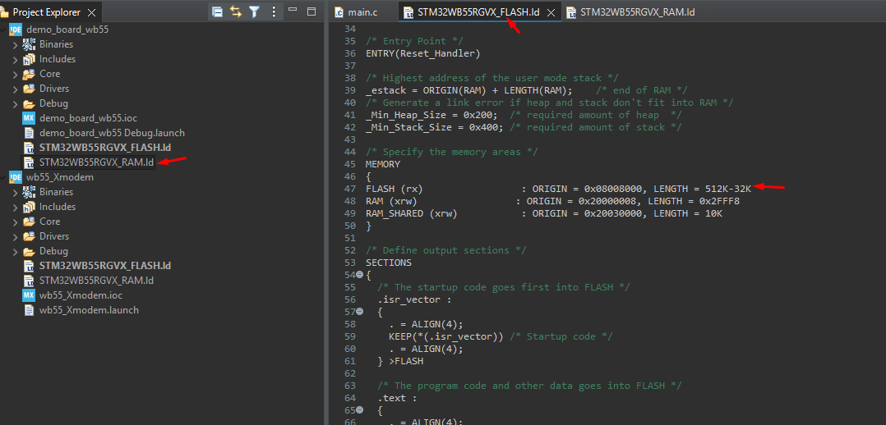
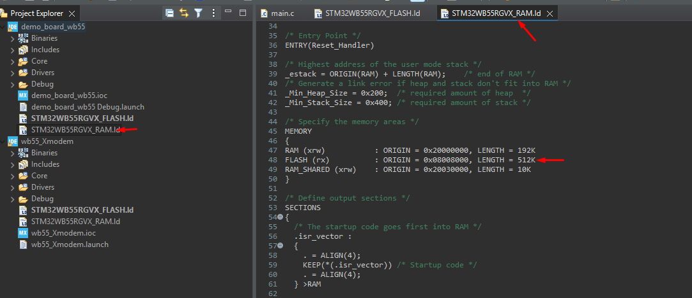
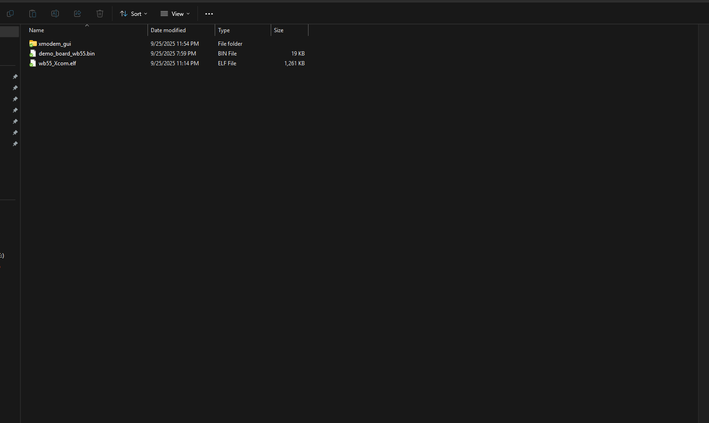
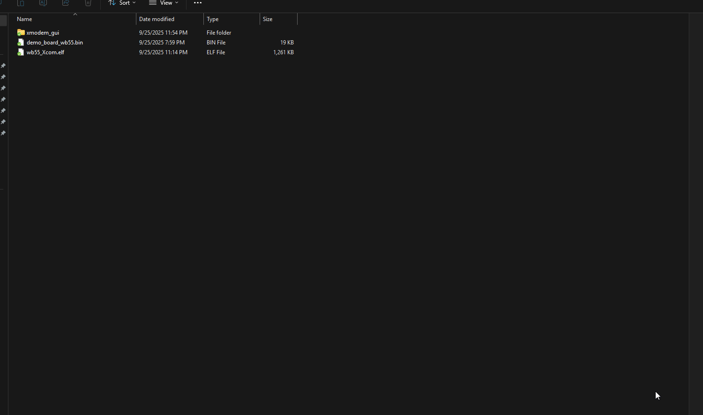

# STM32 XMODEM IAP Bootloader

STM32 mikrodenetleyicileri için XMODEM protokolü ile UART üzerinden firmware güncellemesi yapabilen bootloader. HAL kütüphanesi kullanılarak genel amaçlı STM32'lerde çalışır.

## 🚀 Özellikler

- **XMODEM protokolü** ile güvenli dosya transferi  
- **UART** (921600 baud) üzerinden firmware güncelleme
- **Flash bellek yönetimi** (Bootloader: 32KB, Uygulama: 480KB)
- **Python GUI** ve **Tera Term** desteği

 

## 📁 Proje Yapısı

- `wb55_Xmodem/` - Ana bootloader projesi (XMODEM + Flash + UART)
- `demo_board_wb55/` - Test uygulaması

## 💾 Flash Bellek Haritası

- **Bootloader**: `0x08000000-0x08007FFF` (32KB)
- **Uygulama**: `0x08008000-0x0807FFFF` (480KB)

## ⚙️ Hızlı Kurulum

1. **Projeyi klonlayın**: `git clone https://github.com/ttuzz/stm32_xmodem_iap_tool.git`
2. **STM32CubeIDE** ile `wb55_Xmodem` projesini açın ve derleyin
3. **Terminal bağlantısı**: 921600 baud, 8N1
4. **Demo uygulama**: `demo_board_wb55` projesini derleyip `.bin` dosyası oluşturun

## 📱 Kullanım Kılavuzu

### 1. Python GUI ile Firmware Yükleme

Python GUI uygulaması ile `.bin` dosyasını seçip bootloader'a yükleme işlemi.

### 2. Tera Term ile XMODEM Güncelleme  

Tera Term terminal uygulaması kullanarak XMODEM protokolü ile firmware güncelleme işlemi.

## ⚙️ Teknik Detaylar

- **UART**: USART1, 921600 baud, PA9/PA10
- **XMODEM**: 128/1024 byte paketler, CRC-16 kontrolü
- **Flash**: 4KB sektörler, yazma/okuma doğrulaması

## 📝 Lisans

Bu proje MIT lisansı altında dağıtılmaktadır. Detaylar için `LICENSE` dosyasına bakın.

## 👨‍💻 Geliştirici

- **Ferenc Nemeth** - XMODEM protokol implementasyonu
- **ttuzz** - STM32WB55 adaptasyonu ve geliştirme

## 🔗 Referanslar

- [STM32WB55 Reference Manual](https://www.st.com/resource/en/reference_manual/rm0434-multiprotocol-wireless-32bit-mcu-armbased-cortexm4-with-fpu-bluetooth-lowenergy-and-8021154-radio-solution-stmicroelectronics.pdf)
- [XMODEM Protocol Specification](http://web.mit.edu/6.115/www/amulet/xmodem.htm)
- [STM32CubeIDE User Guide](https://www.st.com/resource/en/user_manual/um2609-stm32cubeide-user-guide-stmicroelectronics.pdf)

## 💡 Notlar

- XMODEM-CRC modu kullanılır
- Maksimum dosya boyutu: 480KB
- İlk test için demo uygulamasını kullanın
- HAL kütüphanesi sayesinde tüm STM32 serilerinde çalışır

---
⭐ **Beğendiyseniz yıldızlamayı unutmayın!**